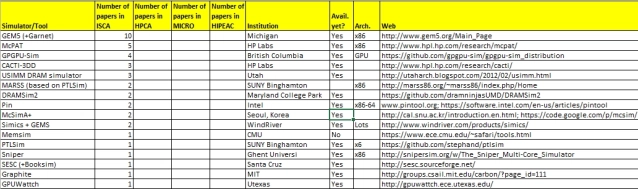

# Tools and Utilities

- [1. Tools](#1-tools)
  - [1.1. Simulators](#11-simulators)
    - [1.1.1. Architectural](#111-architectural)
    - [1.1.2. Hardware Accelerator (incl. GPU) simulators](#112-hardware-accelerator-incl-gpu-simulators)
    - [1.1.3. Micro-architecture/ISA simulators](#113-micro-architectureisa-simulators)
    - [1.1.4. Memory Simulators](#114-memory-simulators)
    - [1.1.5. Interconnect Simulators](#115-interconnect-simulators)
    - [1.1.6. Benchmarking/Profiling](#116-benchmarkingprofiling)
  - [1.2. Open Source Tools for Digital Design](#12-open-source-tools-for-digital-design)
    - [1.2.1. Digital/Analog Simulators](#121-digitalanalog-simulators)
  - [1.3. Emulators](#13-emulators)
- [2. Utilities](#2-utilities)
  - [2.1. Hardware Design](#21-hardware-design)
- [3. Misc](#3-misc)

## 1. Tools

### 1.1. Simulators

#### 1.1.1. Architectural

- [gem5](http://gem5.org/Main_Page) - The gem5 simulator is a modular platform for computer-system architecture research, encompassing system-level architecture as well as processor microarchitecture.
  - [Lapidary](https://github.com/efeslab/lapidary) - Tool to enable more efficient gem5 simulations
- [CPULator](https://cpulator.01xz.net/) - CPUlator Computer System Simulator designed as a tool for learning assembly-language programming and computer organization
- [ESESC](https://github.com/masc-ucsc/esesc) - A fast multiprocessor simulator with detailed power, thermal, and performance models for modern out-of-order multicores.
- [Multi2Sim](http://www.multi2sim.org/) - Multi2Sim is a heterogeneous system simulator of CPUs and GPUs, used to test and validate new hardware designs before they are physically manufactured.
- [SniperSim](https://snipersim.org//w/The_Sniper_Multi-Core_Simulator) - A multi-core, parallel, high-speed and accurate x86 simulator.
- [ZSim](https://github.com/s5z/zsim) - zsim is a fast x86-64 simulator with a focus on simulating memory hierarchies and large, heterogeneous systems
- [MacSim](https://github.com/gthparch/macsim) - A heterogeneous architecture timing model simulator.
- [CACTI](https://github.com/HewlettPackard/cacti) - An analytical tool that takes a set of cache/memory parameters as input and calculates its access time, power, cycle time, and area.
- [WATTCH](http://www.eecs.harvard.edu/~dbrooks/wattch-form.html) - Architectural simulator that estimates CPU power consumption. [Example](http://www.ecs.umass.edu/ece/koren/architecture/ETCache/tools_used.html)
- [HotSpot](http://lava.cs.virginia.edu/HotSpot/) -  An accurate and fast thermal model suitable for use in architectural studies.
- [SESC](http://sesc.sourceforge.net/) - SuperScalar simulator is a cycle accurate architectural simulator that models a very wide set of architectures: single processors, CMPs, PIMs, and thread level speculation.

**Full-system simulators and their popularity in conferences** (table from 2015)

#### 1.1.2. Hardware Accelerator (incl. GPU) simulators

- [Accel-Sim](https://accel-sim.github.io/) - Simulation framework for simulating and validating programmable accelerators like GPUs
- [GPGPU Sim](gpgpu-sim.org) - GPGPU-Sim provides a detailed simulation model of a contemporary GPUs
- [FireSim](https://fires.im) - FireSim is an open-source cycle-accurate FPGA-accelerated full-system hardware simulation platform that runs on cloud FPGAs
- [MPGPUSim](https://gitlab.com/akita/mgpusim/-/tree/master) - MGPUSim is a Go based AMD GCN3 GPU simulator based-on the Akita framework.
- [SCALESim](https://github.com/ARM-software/SCALE-Sim) - SCALE sim is a CNN accelerator simulator, that provides cycle-accurate timing, power/energy, memory bandwidth and trace results for a specified accelerator configuration and neural network architecture.
- [STONNE](https://github.com/stonne-simulator/stonne) - Simulation TOol of Neural Network Engines, a cycle-level, highly-modular and highly-extensible simulation framework that can plug into any high-level DNN framework as an accelerator device and perform end-to-end evaluation of flexible accelerator microarchitectures with sparsity support, running complete DNN models.

#### 1.1.3. Micro-architecture/ISA simulators

- [ChampSim](https://github.com/ChampSim/ChampSim) - ChampSim is a trace-based simulator for a microarchitecture study.
- [Mastik](https://cs.adelaide.edu.au/~yval/Mastik/)  - A Micro-Architectural Side-Channel Toolkit
- [Venus](https://github.com/kvakil/venus) - Venus is a RISC-V instruction set simulator built for education.
- [Ripes](https://github.com/mortbopet/Ripes) - Ripes is a visual computer architecture simulator and assembly code editor built for the RISC-V ISA.
- [WinMIPS64](http://indigo.ie/~mscott/) - WinMIPS64 is an instruction set simulator, and is designed as a replacement for the popular Microsoft Windows utility WinDLX
- [Whisper](https://github.com/chipsalliance/SweRV-ISS) - RISCV instruction set simulator (ISS) developed for the verification of the Swerv micro-controller. It allows the user to run RISCV code without RISCV hardware.
- [CompilerExplorer](https://godbolt.org/)
- [The uops.info Code Analyzer](https://uica.uops.info/)
- [SIMD Giraffe](https://pmntang.github.io/SIMDGiraffe/#/) - Break down x86 SIMD instructions

#### 1.1.4. Memory Simulators

- [PyCacheSim](https://github.com/RRZE-HPC/pycachesim) - Accurately simulate the caching (allocation/hit/miss/replace/evict) behavior of all cache levels found in modern processors
- [VANS](https://github.com/TheNetAdmin/VANS) - A validated NVRAM simulator
- [LENS](https://github.com/TheNetAdmin/LENS) - A Low-level NVRAM Profiler
- [NVMain](https://github.com/SEAL-UCSB/NVmain) -  An Architectural Level Main Memory Simulator for Emerging Non-Volatile Memories
- [Cache simulator](https://github.com/CoffeeBeforeArch/cache_simulator) - A simple trace-based cache simulator
- [DRAMSim2](https://github.com/umd-memsys/DRAMSim2) - A cycle accurate DRAM simulator
- [ARM Consistency Memory Model](https://developer.arm.com/architectures/cpu-architecture/a-profile/memory-model-tool) - The herd tool allows the user to execute the model with a specific question about the possible final states of the program using ARM consistency memory model.
- [MQSim](https://github.com/CMU-SAFARI/MQSim) - A Simulator for Modern NVMe and SATA SSDs
- [VAMPIRE](https://github.com/CMU-SAFARI/VAMPIRE) - Variation-Aware model of Memory Power Informed by Real Experiments is an open-source DRAM power model based on an extensive experimental characterization of the power consumption of real DRAM modules.
- [RAMulator](https://github.com/CMU-SAFARI/ramulator) - Ramulator is a fast and cycle-accurate DRAM simulator [1] that supports a wide array of commercial, as well as academic, DRAM standards
- [Intel TSX MESI Cache simulator](https://www.scss.tcd.ie/Jeremy.Jones/VivioJS/caches/TSX.htm) - Animations to illustrate cache behavior

#### 1.1.5. Interconnect Simulators

- [BookSim](https://github.com/thats-all-forks/booksim2) - A cycle-accurate interconnection network simulator
- [NetTrace](http://www.cs.utexas.edu/~netrace/) -  Dependency-Tracking Trace-Based Network-on-Chip Simulation. [Source code](https://github.com/thats-all-forks/netrace)
- [Noxim](https://github.com/davidepatti/noxim) - Network-on-Chip Simulator
- [NIRGAM](http://nirgam.ecs.soton.ac.uk/) - A Simulator for NoC Interconnect Routing and Application Modeling

#### 1.1.6. Benchmarking/Profiling

- [MLPerf](https://mlcommons.org/en/training-normal-07/) - Consistent measurements of accuracy, speed, and efficiency on hardware for ML workloads
- [tp-parsec](https://github.com/massivethreads/tp-parsec) - Task-Parallel PARSEC
- [VTune™ Profiler Performance Analysis Cookbook](https://software.intel.com/content/www/us/en/develop/documentation/vtune-cookbook/top.html)
- [Google Workload Traces](https://dynamorio.org/google_workload_traces.html) - Warehouse scale traces captured using DynamoRIO's drmemtrace. The traces are records of instruction and memory accesses as described at Trace Format
- [Utility for Core to Core latency measurements](https://github.com/nviennot/core-to-core-latency)

### 1.2. Open Source Tools for Digital Design

- [Verilator](https://www.veripool.org/projects/verilator/) - Verilator is the fastest free Verilog HDL simulator, and outperforms most commercial simulators
- [Icarus Verilog](https://github.com/steveicarus/iverilog) - Icarus Verilog is not aimed at being a simulator in the traditional sense, but a compiler that generates code employed by back-end tools.
- [SymbiFlow](https://symbiflow.github.io) - Open source FPGA tooling available under [YosysHQ](https://github.com/YosysHQ)
- [GTKWave](http://gtkwave.sourceforge.net/) - GTKWave is a fully featured GTK+ based wave viewer.
- [Wavedrom](https://wavedrom.com/) - WaveDrom draws your Timing Diagram or Waveform from simple textual description.
- [SymbiYosys](https://github.com/YosysHQ/SymbiYosys) - Front-end for Yosys-based formal verification flows
- [Upscale Project](http://upscale.stanford.edu/) - Formal tools for OSH
- [Yosys](http://www.clifford.at/yosys/) - Yosys is a framework for Verilog RTL synthesis.
- [Open Timer](https://github.com/OpenTimer/OpenTimer) - A High-Performance Timing Analysis Tool for VLSI Systems
- [Glade](https://peardrop.co.uk/) - Fast IC layout and schematic editor capable of reading and writing common EDA formats
- [OpenRAM](https://openram.soe.ucsc.edu) - An [open-source](https://github.com/VLSIDA/OpenRAM) static random access memory (SRAM) compiler.
- [Open Circuit Design Flow](http://opencircuitdesign.com/) - A suite of tools including Qflow covering various aspects of digital design
  - [Magic](http://opencircuitdesign.com/magic/index.html) - the VLSI layout editor, extraction, and DRC tool.
  - [XCircuit](http://opencircuitdesign.com/xcircuit/index.html) - the circuit drawing and schematic capture tool.
  - [IRSIM](http://opencircuitdesign.com/irsim/index.html) - the switch-level digital circuit simulator.
  - [Netgen](http://opencircuitdesign.com/netgen/index.html) - the circuit netlist comparison (LVS) and netlist conversion tool.
  - [Qrouter](http://opencircuitdesign.com/qrouter/index.html) - the over-the-cell (sea-of-gates) detail router.
  - [Qflow](http://opencircuitdesign.com/qflow/index.html) - a complete digital synthesis design flow using open-source software and open-source standard cell libraries.
  - [PCB](http://opencircuitdesign.com/pcb/index.html) - the printed circuit board layout editor.
- [ngspice](http://ngspice.sourceforge.net/) - open source spice simulator
- [gnucap](http://gnucap.org/dokuwiki/doku.php?id=gnucap:start) - open source mixed-signal simulator supporting Spice and Verilog syntax, also see [GnuCap GitBook](https://mulder-patrick.gitbook.io/gnucap/)
- [The Open Road Project](https://github.com/The-OpenROAD-Project) - Includes [OpenSTA](https://github.com/The-OpenROAD-Project/OpenSTA), [RePlAce](https://github.com/The-OpenROAD-Project/RePlAce), [OpenDB](https://github.com/The-OpenROAD-Project/OpenDB), [ioPlacer](https://github.com/The-OpenROAD-Project/ioPlacer), [FastRoute4](https://github.com/The-OpenROAD-Project/FastRoute4-lefdef) and other tools. [Start here](https://github.com/The-OpenROAD-Project/OPENROAD_USERS_READ_ME_FIRST)
- [Open Register Design](https://github.com/Juniper/open-register-design-tool) - Tool to generate register RTL, models, and docs using SystemRDL or JSpec input
- [LibrePCB](https://librepcb.org/) - A powerful, innovative and intuitive EDA tool for everyone!
- [ACT Tools Suite](http://avlsi.csl.yale.edu/act/doku.php) - Asynchronous Circuit Design Toolkit to support the design and implementation of asynchronous logic
- [PyMTL](https://github.com/cornell-brg/pymtl) - PyMTL is an open-source, Python-based framework for multi-level hardware modeling.
- [OpenFPGA](https://github.com/LNIS-Projects/OpenFPGA) - FPGA IP generator supporting highly-customizable homogeneous FPGA architectures
- [LibSystemCTLM](https://github.com/Xilinx/libsystemctlm-soc/blob/master/README.md) - This library contains various SystemC/TLM-2.0 modules that enable co-simulation of Xilinx QEMU, SystemC/TLM-2.0 models and RTL.
- [Fully autonomous SoC Synthesis](https://github.com/idea-fasoc/fasoc) - focused on developing a complete system-on-chip (SoC) synthesis tool from user specification to GDSII.
- [EDALIZE](https://github.com/olofk/edalize) - Edalize is a Python Library for interacting with EDA tools.
- [Open Source (FOSS) FPGA (EDA) Tooling Interchange Formats + Toolchain parts](https://j.mp/openfpga-diagram)
- [nMigen](https://github.com/m-labs/nmigen) - A refreshed Python toolbox for building complex digital hardware
- [Cascade](https://github.com/vmware/cascade) - Just-in-time compiler for Verilog
- [PyRTL](http://ucsbarchlab.github.io/PyRTL/) - A collection of classes for pythonic register-transfer level design, simulation, tracing, and testing suitable for teaching and research.
- [myHDL](http://www.myhdl.org/) - MyHDL turns Python into a hardware description and verification language
- [LLHD](http://www.llhd.io/) - is an intermediate representation for digital circuit descriptions, together with an accompanying simulator and SystemVerilog/VHDL compiler.
- [TerosHDL](https://github.com/TerosTechnology/terosHDL) - It is a  open source IDE to make FPGA development easier
- [OpenLane](https://github.com/efabless/openlane) - Automated RTL to GDSII flow based on several components including OpenROAD, Yosys, Magic, Netgen, Fault and custom methodology scripts for design exploration and optimization.
- [DREAMPlace](https://github.com/limbo018/DREAMPlace) - Deep learning toolkit-enabled VLSI placement
- [SiliconCompiler](https://github.com/siliconcompiler/siliconcompiler) - A modular build system for hardware ("make for silicon"). The project philosophy is to "make the complex possible while keeping the simple simple".

#### 1.2.1. Digital/Analog Simulators

- [DigitalJS](https://github.com/tilk/digitaljs) - Visualize and simulate digital logic using HDL
- [Digital](https://github.com/hneemann/Digital) - Digital is a easy-to-use digital logic designer and circuit simulator designed for educational purposes.
- [EDA Playground](https://www.edaplayground.com/) - Run HDL/HVL code in your browser
- [Electronic Circuit Simulator](https://www.falstad.com/circuit/) - Falstad circuit simulator
- [ASMBits](https://asmbits.01xz.net/wiki/Main_Page) - Assembly Practice
- [HDLBits](https://hdlbits.01xz.net/wiki/Main_Page) - Verilog Practice
- [8bit Workshop](http://8bitworkshop.com/redir.html?platform=verilog) - Verilog to waves instantly
- [Logic Design and Circuit Simulator](https://github.com/hneemann/Digital)
- [LogicEmu](https://lodev.org/logicemu/) - Logic simulator in your browser
- [Transistor level 6502 Hardware Simulation in Javascript](https://github.com/trebonian/visual6502) - [Visual6502](https://floooh.github.io/visual6502remix/)
- [Xyce](https://xyce.sandia.gov/) - open source, SPICE-compatible, high-performance analog circuit simulator, capable of solving extremely large circuit problems by supporting large-scale parallel computing platforms.
- [Micro Cap 12](http://www.spectrum-soft.com/download/download.shtm) - Micro-Cap 12 is an integrated schematic editor and mixed analog/digital simulator that provides an interactive sketch and simulate environment for electronics engineers. Now Open Source.
- [Logisim](http://www.cburch.com/logisim/) - Logisim is an educational tool for designing and simulating digital logic circuits.
- [LogisimITA](http://www.logisim.altervista.org/) - An independently developed fork of logisim that's preferred by many
- [Logisim-Evolution](https://github.com/reds-heig/logisim-evolution/) - Another flavour of Logisim after the development of original version was stopped
- [Antares](https://www.antarescircuit.io/) - Digital Circuit Learning Platform. A free, powerful platform for designing, simulating and explaining digital circuits
- [MakerChip](https://www.makerchip.com/) - In-browser Verilog design environment

### 1.3. Emulators

- [TinyEMU](https://bellard.org/tinyemu/) - TinyEMU is a system emulator for the RISC-V and x86 architectures.
- [Unicorn](https://www.unicorn-engine.org/) - Unicorn is a lightweight multi-platform, multi-architecture CPU emulator framework.
- [Emulator for Ben Eater's 8bit computer](https://fizzgig.itch.io/8-bit-breadboard-computer)
- [8bit Chip Emulator](https://github.com/floooh/chips) - A toolbox of 8-bit chip-emulators, helper code and complete embeddable system emulators
- [Little Man Computer](https://peterhigginson.co.uk/lmc/) - Very simple Von Neumann Architecture Computer. Similar [RISC](https://peterhigginson.co.uk/RISC/)
- [Blinken Lights](https://justine.lol/blinkenlights/) - a command line debugger that focuses on visualizing how software changes memory. It's able to emulate statically linked i8086 and x86_64-pc-linux-gnu programs

## 2. Utilities

### 2.1. Hardware Design

- [Data sheet scrubber](https://github.com/idea-fasoc/datasheet-scrubber) - The FASoC Datasheet Scrubber is a utility that scrubs through large sets of PDF datasheets/documents in order to extract key circuit information.
- [SystemVerilog Unit Test \(SVUT\)](https://github.com/damofthemoon/svut) - SVUT is a very simple flow to create a Verilog/SystemVerilog unit test.
- [AirHDL](https://airhdl.com) - Create register maps and headers
- [BitBench](http://triq.net/bitbench) - Visually dissect and analyze bit strings.
- [Bitfield](https://github.com/drom/bitfield) - BitField diagram Renderer
- [Diagrammer](https://github.com/freechipsproject/diagrammer) - Provides dot visualizations of chisel/firrtl circuites
- [VCD2Wavedrom](https://github.com/Toroid-io/vcd2wavedrom) - Handy for getting from simulation to spec quickly.
- [ipyxact](https://github.com/olofk/ipyxact) - Python-based IP-XACT parser
- [sv2v](https://github.com/zachjs/sv2v) - SystemVerilog to Verilog conversion
- [svlint](https://github.com/dalance/svlint) - System Verilog lint using rust
- [Wavedrom to Verilog](https://github.com/wavedrom/verilog)
- [HDL Checker](https://github.com/suoto/hdl_checker/blob/master/README.md) - HDL Checker is a language server that wraps VHDL/Verilg/SystemVerilog tools that aims to reduce the boilerplate code needed to set things up.
- [Wavedrom to ASCII converter](https://github.com/Wren6991/asciiwave) - README embeddable waveforms!
- [RgGen](https://github.com/rggen/rggen) - RgGen is a code generation tool for ASIC/IP/FPGA/RTL engineers. It will automatically generate soruce code related to configuration and status registers \(CSR\)
- [System RDL Compiler](https://github.com/SystemRDL/systemrdl-compiler) - The systemrdl-compiler module implements a generic compiler front-end for Accellera's SystemRDL 2.0 register description language.
- [Verismith](https://github.com/ymherklotz/verismith) - Verilog Fuzzer to test the major simulators and sythesisers by generating random, valid Verilog.
- [Jeff's ASIC tools](http://www.kwcpa.com/tools/) - Useful tools for working with HDL
- [Static Timing Analysis Diagram Renderer](https://github.com/drom/sta) - Altera Quartus/ Icestorm report parser
- [Bitfield/Register representations](https://observablehq.com/@drom/bitfield-testbox) - Editable examples of registers
- [Verible](https://github.com/google/verible) - Verible is a suite of SystemVerilog developer tools, including a parser, style-linter, and formatter.
- [svinst](https://github.com/sgherbst/svinst) - This tool takes a SystemVerilog file as input and produces as output the module(s) declared in that file, along with the module(s) instantiated in each one of those module declarations. It uses sv-parser and is adapted from svlint.

## 3. Misc

- [Online ARM Assember](https://azm.azerialabs.com/)
- [Hexyl](https://github.com/sharkdp/hexyl) - A command-line hex viewer
- [Scastie](https://scastie.scala-lang.org/) - Playground for Chisel 3: A Modern Hardware Design Language
- [vcdMaker](https://vcdmaker.org/) - Open application for translating text log files into the VCD (Variable Change Dump) format files. It is supposed to help you to debug your applications and systems
- [ImHex](https://github.com/WerWolv/ImHex) -  A Hex Editor for Reverse Engineers, Programmers
